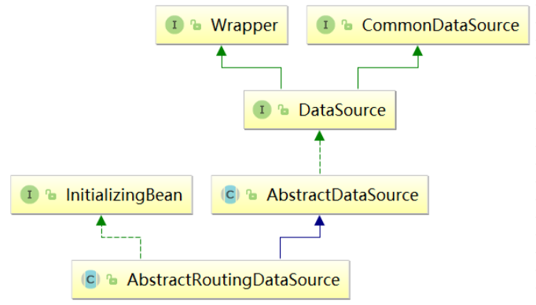

#  [SpringBoot+MyBatis+MySQL读写分离](https://www.cnblogs.com/cjsblog/p/9712457.html)
[TOC]
## 1、引言

> 读写分离要做的事情就是对于一条SQL该选择哪个数据库去执行，至于谁来做选择数据库这件事儿，无非两个，要么中间件帮我们做，要么程序自己做。因此，一般来讲，读写分离有两种实现方式。第一种是依靠中间件（比如：MyCat），也就是说应用程序连接到中间件，中间件帮我们做SQL分离；第二种是应用程序自己去做分离。这里我们选择程序自己来做，主要是利用Spring提供的路由数据源，以及AOP
>
> 然而，应用程序层面去做读写分离最大的弱点（不足之处）在于无法动态增加数据库节点，因为数据源配置都是写在配置中的，新增数据库意味着新加一个数据源，必然改配置，并重启应用。当然，好处就是相对简单。


##  2、AbstractRoutingDataSource
基于特定的查找key路由到特定的数据源。它内部维护了一组目标数据源，并且做了路由key与目标数据源之间的映射，提供基于key查找数据源的方法。


## 3、实践
### 3-1、环境准备
①三个数据库
②基础的web项目
### 3-2、数据源配置
**application.yml**
```yaml
# 多数据库读写分离
spring:
  datasource:
    master:
      jdbc-url: jdbc:mysql://127.0.0.1:3306/db_mysql_read_write_1?useUnicode=true&characterEncoding=UTF-8&serverTimezone=UTC
      username: root
      password: 123456
      driver-class-name: com.mysql.jdbc.Driver
    slave1:
      jdbc-url: jdbc:mysql://127.0.0.1:3306/db_mysql_read_write_2?useUnicode=true&characterEncoding=UTF-8&serverTimezone=UTC
      username: root   # 只读库
      password: 123456
      driver-class-name: com.mysql.jdbc.Driver
    slave2:
      jdbc-url: jdbc:mysql://127.0.0.1:3306/db_mysql_read_write_3?useUnicode=true&characterEncoding=UTF-8&serverTimezone=UTC
      username: root   # 只读库
      password: 123456
      driver-class-name: com.mysql.jdbc.Driver
```
**多数据源配置**
```java
package com.wyp.config;

import com.wyp.constant.DBTypeEnum;
import org.springframework.beans.factory.annotation.Qualifier;
import org.springframework.boot.context.properties.ConfigurationProperties;
import org.springframework.boot.jdbc.DataSourceBuilder;
import org.springframework.context.annotation.Bean;
import org.springframework.context.annotation.Configuration;

import javax.sql.DataSource;
import java.util.HashMap;
import java.util.Map;

@Configuration
public class DataSourceConfig {

    @Bean
    @ConfigurationProperties("spring.datasource.master")
    public DataSource masterDataSource() {
        return DataSourceBuilder.create().build();
    }

    @Bean
    @ConfigurationProperties("spring.datasource.slave1")
    public DataSource slave1DataSource() {
        return DataSourceBuilder.create().build();
    }

    @Bean
    @ConfigurationProperties("spring.datasource.slave2")
    public DataSource slave2DataSource() {
        return DataSourceBuilder.create().build();
    }

    @Bean
    public DataSource myRoutingDataSource(@Qualifier("masterDataSource") DataSource masterDataSource,
                                          @Qualifier("slave1DataSource") DataSource slave1DataSource,
                                          @Qualifier("slave2DataSource") DataSource slave2DataSource) {
        Map<Object, Object> targetDataSources = new HashMap<>();
        targetDataSources.put(DBTypeEnum.MASTER, masterDataSource);
        targetDataSources.put(DBTypeEnum.SLAVE1, slave1DataSource);
        targetDataSources.put(DBTypeEnum.SLAVE2, slave2DataSource);
        MyRoutingDataSource myRoutingDataSource = new MyRoutingDataSource();
        myRoutingDataSource.setDefaultTargetDataSource(masterDataSource);
        myRoutingDataSource.setTargetDataSources(targetDataSources);
        return myRoutingDataSource;
    }

}
```
这里，我们配置了4个数据源，1个master，2两个slave，1个路由数据源。前3个数据源都是为了生成第4个数据源，而且后续我们只用这最后一个路由数据源。

**MyBatis配置**

```java
package com.wyp.config;

import org.apache.ibatis.session.SqlSessionFactory;
import org.mybatis.spring.SqlSessionFactoryBean;
import org.springframework.context.annotation.Bean;
import org.springframework.context.annotation.Configuration;
import org.springframework.core.io.support.PathMatchingResourcePatternResolver;
import org.springframework.jdbc.datasource.DataSourceTransactionManager;
import org.springframework.transaction.PlatformTransactionManager;
import org.springframework.transaction.annotation.EnableTransactionManagement;

import javax.annotation.Resource;
import javax.sql.DataSource;

@EnableTransactionManagement
@Configuration
public class MyBatisConfig {

    @Resource(name = "myRoutingDataSource")
    private DataSource myRoutingDataSource;

    @Bean
    public SqlSessionFactory sqlSessionFactory() throws Exception {
        SqlSessionFactoryBean sqlSessionFactoryBean = new SqlSessionFactoryBean();
        sqlSessionFactoryBean.setDataSource(myRoutingDataSource);
        sqlSessionFactoryBean.setMapperLocations(new PathMatchingResourcePatternResolver().getResources("classpath:mapper/*.xml"));
        return sqlSessionFactoryBean.getObject();
    }

    @Bean
    public PlatformTransactionManager platformTransactionManager() {
        return new DataSourceTransactionManager(myRoutingDataSource);
    }
}
```

由于Spring容器中现在有4个数据源，所以我们需要为事务管理器和MyBatis手动指定一个明确的数据源。
### 3.3、设置路由key / 查找数据源

目标数据源就是那前3个（master/salve1/salve2），但是使用的时候是如果查找数据源的呢？

首先，我们定义一个枚举来代表这三个数据源

```java
package com.wyp.constant;

public enum DBTypeEnum {

    MASTER, SLAVE1, SLAVE2;

}
```

通过ThreadLocal将数据源设置到每个线程上下文中

```
package com.wyp.config;

import com.wyp.constant.DBTypeEnum;

import java.util.concurrent.atomic.AtomicInteger;

public class DBContextHolder {

    private static final ThreadLocal<DBTypeEnum> contextHolder = new ThreadLocal<>();

    private static final AtomicInteger counter = new AtomicInteger(-1);

    public static void set(DBTypeEnum dbType) {
        contextHolder.set(dbType);
    }

    public static DBTypeEnum get() {
        return contextHolder.get();
    }

    public static void master() {
        set(DBTypeEnum.MASTER);
        System.out.println("切换到master");
    }

    public static void slave() {
        //  轮询
        int index = counter.getAndIncrement() % 2;
        if (counter.get() > 9999) {
            counter.set(-1);
        }
        if (index == 0) {
            set(DBTypeEnum.SLAVE1);
            System.out.println("切换到slave1");
        }else {
            set(DBTypeEnum.SLAVE2);
            System.out.println("切换到slave2");
        }
    }

}
```

获取路由key

```java
package com.wyp.config;

import org.springframework.jdbc.datasource.lookup.AbstractRoutingDataSource;
import org.springframework.lang.Nullable;

public class MyRoutingDataSource extends AbstractRoutingDataSource {
    @Nullable
    @Override
    protected Object determineCurrentLookupKey() {
        return DBContextHolder.get();
    }

}
```

设置路由key

默认情况下，所有的查询都走从库，插入/修改/删除走主库。我们通过方法名来区分操作类型（CRUD）

```java
package com.wyp.aspect;

import com.wyp.config.DBContextHolder;
import org.apache.commons.lang3.StringUtils;
import org.aspectj.lang.JoinPoint;
import org.aspectj.lang.annotation.Aspect;
import org.aspectj.lang.annotation.Before;
import org.aspectj.lang.annotation.Pointcut;
import org.springframework.stereotype.Component;

@Aspect
@Component
public class DataSourceAop {

    @Pointcut("!@annotation(com.wyp.annotation.Master) " +
            "&& (execution(* com.wyp.service..*.query*(..)) " +
            "|| execution(* com.wyp.service..*.get*(..)))")
    public void readPointcut() {

    }

    @Pointcut("@annotation(com.wyp.annotation.Master) " +
            "|| execution(* com.wyp.service..*.insert*(..)) " +
            "|| execution(* com.wyp.service..*.add*(..)) " +
            "|| execution(* com.wyp.service..*.update*(..)) " +
            "|| execution(* com.wyp.service..*.edit*(..)) " +
            "|| execution(* com.wyp.service..*.delete*(..)) " +
            "|| execution(* com.wyp.service..*.remove*(..))")
    public void writePointcut() {

    }

    @Before("readPointcut()")
    public void read() {
        DBContextHolder.slave();
    }

    @Before("writePointcut()")
    public void write() {
        DBContextHolder.master();
    }


    /**
     * 另一种写法：if...else...  判断哪些需要读从数据库，其余的走主数据库
     */
//    @Before("execution(* com.wyp.service.impl.*.*(..))")
//    public void before(JoinPoint jp) {
//        String methodName = jp.getSignature().getName();
//
//        if (StringUtils.startsWithAny(methodName, "get", "select", "find")) {
//            DBContextHolder.slave();
//        }else {
//            DBContextHolder.master();
//        }
//    }
}
```

有一般情况就有特殊情况，特殊情况是某些情况下我们需要强制读主库，针对这种情况，我们定义一个主键，用该注解标注的就读主库

```java
package com.wyp.annotation;

public @interface Master {
}
```

假设我们有一张user表

```java
package com.wyp.service.impl;

import com.wyp.annotation.Master;
import com.wyp.entity.User;
import com.wyp.dao.UserDao;
import com.wyp.service.UserService;
import org.springframework.stereotype.Service;

import javax.annotation.Resource;
import java.util.List;

/**
 * (User)表服务实现类
 *
 * @author makejava
 * @since 2020-11-17 15:50:46
 */
@Service("userService")
public class UserServiceImpl implements UserService {
    @Resource
    private UserDao userDao;

    /**
     * 通过ID查询单条数据
     *
     * @param id 主键
     * @return 实例对象
     */
    @Override
    public User queryById(Integer id) {
        return this.userDao.queryById(id);
    }

    /**
     * 查询多条数据
     *
     * @param offset 查询起始位置
     * @param limit 查询条数
     * @return 对象列表
     */
    @Override
    public List<User> queryAllByLimit(int offset, int limit) {
        return this.userDao.queryAllByLimit(offset, limit);
    }

    @Override
    public List<User> queryAll() {
        return userDao.queryAll(null);
    }

    @Master
    @Override
    public String getToken(String appId) {
        //  有些读操作必须读主数据库
        //  比如，获取微信access_token，因为高峰时期主从同步可能延迟
        //  这种情况下就必须强制从主数据读
        return "获取到token";
    }

    /**
     * 新增数据
     *
     * @param user 实例对象
     * @return 实例对象
     */
    @Master
    @Override
    public User insert(User user) {
        this.userDao.insert(user);
        return user;
    }

    /**
     * 修改数据
     *
     * @param user 实例对象
     * @return 实例对象
     */
    @Override
    public User update(User user) {
        this.userDao.update(user);
        return this.queryById(user.getId());
    }

    /**
     * 通过主键删除数据
     *
     * @param id 主键
     * @return 是否成功
     */
    @Override
    public boolean deleteById(Integer id) {
        return this.userDao.deleteById(id) > 0;
    }
}
```

4、测试

```java
package com.wyp;

import com.wyp.entity.User;
import com.wyp.service.UserService;
import org.junit.jupiter.api.Test;
import org.springframework.beans.factory.annotation.Autowired;
import org.springframework.boot.test.context.SpringBootTest;

@SpringBootTest
class MysqlReadWriteApplicationTests {

    @Autowired
    UserService userService;

    @Test
    void contextLoads() {
    }

    @Test
    public void testRead() {
        for (int i = 0; i < 5; i++) {
            userService.queryAll();
        }
    }

    @Test
    public void testInsert() {
        User user = new User("张三",21);
        userService.insert(user);
    }

    @Test
    public void testUpdate() {
        User user = new User();
        user.setId(3);
        user.setName("李四");
        userService.update(user);
    }

}
```

## 4、测试

读操作时只在只读库之间切换，没有去master库上读取


insert、update、delete等写操作会切换到master上执行写操作


一些需要从master读取的数据，通过使用自定义注解@Master后，去操作也去master数据库中读取

